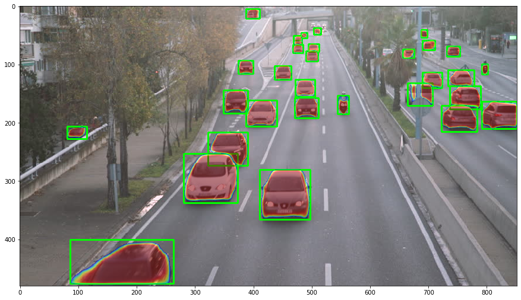
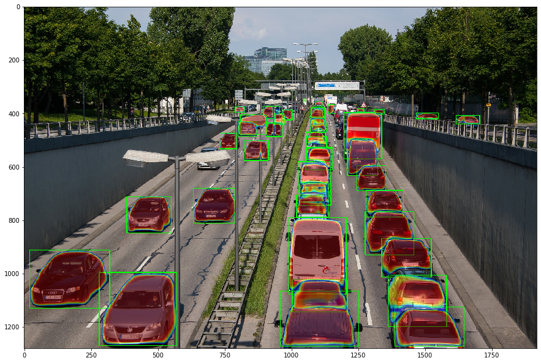

# Vehicle Detection and Segmentation for Traffic Count

Using PyTorch to detect and localize vehicles in an image and count the traffic.

## Dependencies:

  ● torch - version 1.1
  
  ● torchvision - version 0.3
  
  ● matplotlib
  
  ● numpy
  
  ● cv2
 
  
## Examples

## How to run

Inside the script "Traffic Count and Segmentation- PyTorch.py", add your image path to the function call on the last line of code.
